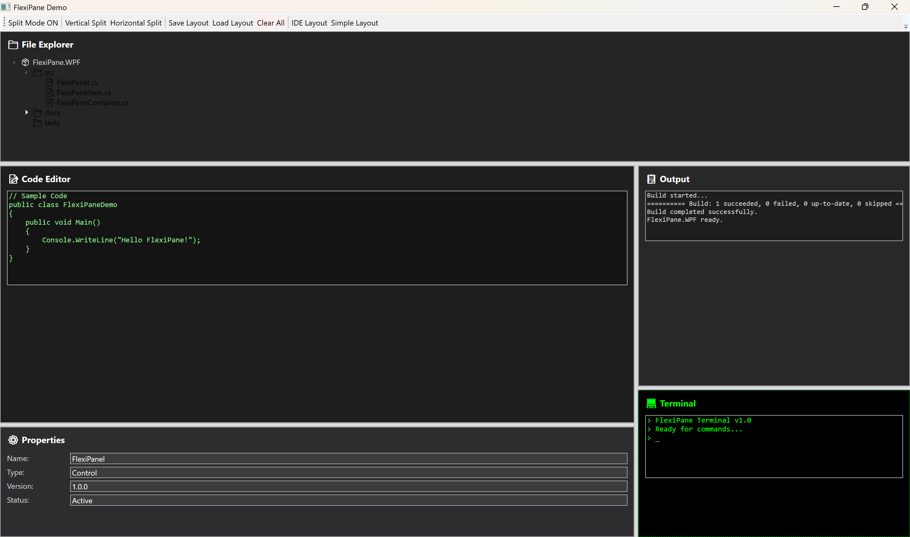
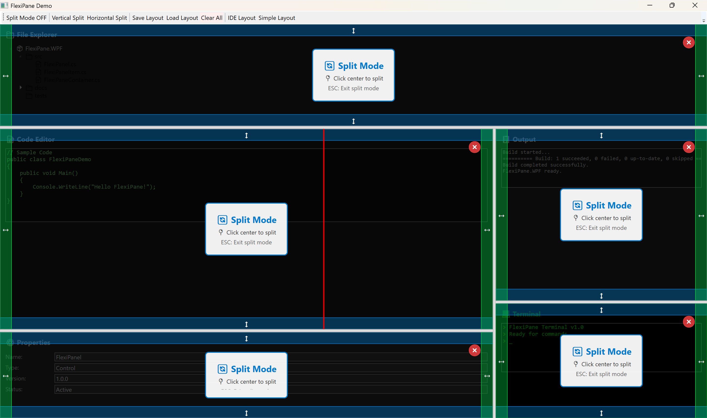

# FlexiPane.WPF

[](https://www.nuget.org/packages/FlexiPane)
[](https://www.nuget.org/packages/FlexiPane)
[](https://github.com/iyulab/FlexiPane.WPF/actions/workflows/dotnet.yml)
[](https://opensource.org/licenses/MIT)

A modern and flexible WPF screen splitting library for dynamic pane management. Create resizable, dockable panels with intuitive split controls and visual feedback.

<div align="center">
  
  
  
  *Left: Multiple panels with complex split layout | Right: Interactive split mode with visual guides*
</div>

## ✨ Features

- 🎯 **Interactive Split Overlays** - Mouse-driven splitting with visual direction guides and hover feedback
- 🎨 **Toggle Split Mode** - Simple boolean property to enable/disable splitting functionality  
- 🔄 **Smart Panel Management** - Advanced visual tree management with proper disposal and cleanup
- 🎮 **Programmatic Control** - Built-in methods for splitting selected panels programmatically
- 🎯 **Focus & Selection** - Automatic focus tracking with visual selection indicators
- 📐 **Flexible Layouts** - Support for complex nested split arrangements with layout serialization
- 🔌 **Event-Driven Architecture** - Unified ContentRequested event system for dynamic content
- 🎨 **Automatic Content Wrapping** - Any UIElement gets automatically wrapped for splitting capability
- ⚡ **High Performance** - Pure WPF implementation with optimized rendering and template caching
- 🛡️ **Safe Mode Toggling** - Split mode can be toggled on/off without losing existing layouts
- 🎛️ **Minimal Configuration** - Works with just `<flexiPane:FlexiPanel />` in XAML
- ⌨️ **Full Keyboard Support** - ESC key handling, focus navigation, and accessibility support
- 💾 **Layout Persistence** - Save and load complex panel layouts to/from files
- 🔧 **Robust Error Handling** - Comprehensive validation and graceful degradation

## 📦 Installation

### Package Manager Console
```powershell
Install-Package FlexiPane.WPF
```

### .NET CLI
```bash
dotnet add package FlexiPane.WPF
```

### PackageReference
```xml
<PackageReference Include="FlexiPane.WPF" Version="1.0.0" />
```

## 🚀 Quick Start

Add the namespace to your XAML:

```xml
xmlns:flexiPane="clr-namespace:FlexiPane.Controls;assembly=FlexiPane"
```

### Simple Usage

Use the simplest possible configuration for basic split functionality:

```xml
<Grid>
  <Grid.RowDefinitions>
    <RowDefinition Height="Auto" />
    <RowDefinition Height="*" />
  </Grid.RowDefinitions>

  <!-- Control Panel -->
  <StackPanel Grid.Row="0" Orientation="Horizontal" Margin="10">
    <ToggleButton x:Name="ModeToggleButton" Content="Toggle Split Mode" Padding="10,5" />
  </StackPanel>

  <!-- FlexiPanel with Event-Driven Content -->
  <flexiPane:FlexiPanel
    x:Name="FlexiPanel"
    Grid.Row="1"
    IsSplitModeActive="{Binding ElementName=ModeToggleButton, Path=IsChecked}"
    ContentRequested="OnContentRequested"
    />
</Grid>
```

### Unified Event-Driven Content Generation

The panel uses a unified event-driven architecture for all content requests:

```csharp
// Handle all content requests - both initial and split operations
private void OnContentRequested(object sender, ContentRequestedEventArgs e)
{
    // Handle initial panel content
    if (e.RequestType == ContentRequestType.InitialPane)
    {
        e.RequestedContent = new Border
        {
            Background = Brushes.LightBlue,
            Child = new TextBlock
            {
                Text = $"Initial Panel {DateTime.Now:HH:mm:ss}",
                HorizontalAlignment = HorizontalAlignment.Center,
                VerticalAlignment = VerticalAlignment.Center
            }
        };
        e.Handled = true;
    }
    // Handle split panel content
    else if (e.RequestType == ContentRequestType.SplitPane)
    {
        e.RequestedContent = new Border
        {
            Background = Brushes.LightGreen,
            Child = new TextBlock
            {
                Text = $"Split Panel {DateTime.Now:HH:mm:ss}\nDirection: {(e.IsVerticalSplit == true ? "Vertical" : "Horizontal")}",
                HorizontalAlignment = HorizontalAlignment.Center,
                VerticalAlignment = VerticalAlignment.Center
            }
        };
        e.Handled = true;
    }
}
```

### Programmatic Splitting

Split the selected panel programmatically:

```csharp
// Split vertically at 50%
flexiPanel.SplitSelectedVertically(0.5);

// Split horizontally with custom content
var customContent = new TextBlock { Text = "New Panel" };
flexiPanel.SplitSelectedHorizontally(0.3, customContent);
```

### Handling Panel Lifecycle Events

Customize behavior through comprehensive events:

```csharp
// Validate panel closing
flexiPanel.PaneClosing += (s, e) => {
    if (HasUnsavedChanges(e.Pane)) {
        e.Cancel = MessageBox.Show("Discard changes?", "Confirm", 
            MessageBoxButton.YesNo) == MessageBoxResult.No;
    }
};

// Handle last panel scenario
flexiPanel.LastPaneClosing += (s, e) => {
    e.Cancel = MessageBox.Show("Close last panel?", "Confirm",
        MessageBoxButton.YesNo) == MessageBoxResult.No;
};

// Track split mode changes
flexiPanel.SplitModeChanged += (s, e) => {
    statusLabel.Text = $"Split Mode: {(e.IsActive ? "ON" : "OFF")}";
};
```

## Architecture

### Core Components

- **FlexiPanel** - Root container managing the entire pane structure
- **FlexiPaneItem** - Individual panels containing user content with interactive split overlays
- **FlexiPaneContainer** - Split containers holding two children with resizable GridSplitter
- **FlexiPaneManager** - Manager handling split/close operations with proper visual tree management

### Tree Structure

The library uses a binary tree structure for managing panels:

```
FlexiPanel
└── RootContent
    ├── FlexiPaneItem (leaf node)
    └── FlexiPaneContainer (branch node)
        ├── FirstChild
        └── SecondChild
```

## Advanced Features

### Interactive Split Mode UI

Enable interactive split mode with visual overlays and mouse interaction:

```xml
<ToggleButton x:Name="SplitToggle" Content="Toggle Split Mode" />
<flexiPane:FlexiPanel IsSplitModeActive="{Binding ElementName=SplitToggle, Path=IsChecked}" />
```

Or programmatically:

```csharp
flexiPanel.IsSplitModeActive = true;
// Interactive split overlays and close buttons are automatically shown
```

When split mode is active:
- **Interactive Split Overlays**: Hover over panels to see split direction guides
- **Mouse-Based Splitting**: Click on overlay regions to split vertically/horizontally
- **Visual Direction Guides**: Clear indicators showing split direction and guide lines
- **Keyboard Navigation**: ESC to exit split mode, focus handling for accessibility
- **Smart Close Operations**: Close buttons with proper visual tree cleanup
- **Toggle off safely**: Disabling split mode preserves all existing panels

### Automatic Content Wrapping

The library automatically handles different content types:

```csharp
private void OnContentRequested(object sender, ContentRequestedEventArgs e)
{
    // Return any UIElement - FlexiPanel automatically wraps it for splitting
    e.RequestedContent = new UserControl(); // Gets wrapped in FlexiPaneItem
    e.RequestedContent = new TextBlock();   // Gets wrapped in FlexiPaneItem
    e.RequestedContent = new FlexiPaneItem(); // Used directly
}
```

### Smart Layout Management

The panel intelligently manages complex layouts:

- **Automatic Structure Preservation**: When split mode is toggled off, existing split layouts are preserved
- **Recursive Split Control**: All nested panels automatically inherit split mode settings  
- **Dynamic Content Loading**: Content is created on-demand when panels are split
- **Memory Efficient**: Only active panels consume resources
- **Visual Tree Cleanup**: Proper disposal prevents memory leaks and visual tree conflicts
- **Template Optimization**: Advanced template caching for improved performance

### Selection and Focus

The library automatically tracks the selected panel:

```csharp
// Get the currently selected panel
var selected = flexiPanel.SelectedItem;

// Set selection programmatically
somePane.IsSelected = true;

// Track selection changes
flexiPanel.SelectionChanged += (s, e) => {
    Console.WriteLine($"Selected: {e.NewSelection?.Title}");
};
```

### Minimal Configuration Usage

For the absolute simplest setup:

```xml
<!-- This works out of the box! -->
<flexiPane:FlexiPanel />
```

The panel will:
- Display helpful instruction text initially
- Activate split functionality when `IsSplitModeActive` is set to `true`
- Generate default content automatically if no event handlers are provided
- Handle all split operations seamlessly

## 🛠️ Requirements

- **.NET 9.0** or later
- **Windows** platform (WPF dependency)
- **WPF** application project

## 📚 Documentation

- [Architecture Design](docs/architecture.md) - System architecture and design principles
- [Splitting Mechanism](docs/splitting-mechanism.md) - Detailed splitting algorithms and tree management
- [Interactive Features](docs/interactive-features.md) - Mouse overlays, visual guides, and user interaction
- [Layout Serialization](docs/layout-serialization.md) - Saving and loading panel arrangements

## 🎮 Demo Application

Check out the [FlexiPane.Samples.DefaultApp](src/FlexiPane.Samples.DefaultApp) project for complete working examples:

### Simple Demo (MainWindowSimple.xaml)
- ✨ **Minimal Setup**: Just a ToggleButton and FlexiPanel
- 🎮 **Event-Driven Content**: Uses unified ContentRequested event
- 🎨 **Random Colored Panels**: Each panel gets a unique color and timestamp
- 🛡️ **Safe Mode Toggling**: Toggle split mode on/off without losing panels
- 🔄 **Automatic Content Wrapping**: Returns simple Border elements that get auto-wrapped

### Full-Featured Demo (MainWindow.xaml)  
- 🎨 Multiple content types (editor, terminal, explorer)
- 💾 Layout save/load functionality
- 🎛️ Content factory system usage
- ⌨️ Keyboard shortcuts and navigation
- 🎯 Programmatic control APIs

To run the demo:
```bash
git clone https://github.com/iyulab/FlexiPane.WPF.git
cd FlexiPane.WPF
dotnet run --project src/FlexiPane.Samples.DefaultApp/
```

The simple demo shows the **minimum code required** to get a fully functional split panel system working!

### Interactive Split Features in Demo

The demo applications showcase advanced interactive features:

- **🎯 Visual Split Overlays**: Hover over panels to see split direction guides
- **🖱️ Mouse-Driven Splitting**: Click top/bottom for vertical split, left/right for horizontal split  
- **📏 Direction Guides**: Visual indicators showing exactly where splits will occur
- **💾 Layout Persistence**: Save and restore complex panel arrangements
- **⌨️ Keyboard Shortcuts**: ESC to exit split mode, Tab navigation between panels
- **🔄 Smart Close Operations**: Close panels with proper visual tree cleanup
- **🎨 Theme Support**: Complete XAML styling with modern visual appearance

## 🤝 Contributing

Contributions are welcome! Please feel free to:

1. 🐛 **Report bugs** by opening an issue
2. 💡 **Suggest features** for future versions
3. 🔧 **Submit pull requests** with improvements
4. 📖 **Improve documentation** or add examples
5. ⭐ **Star the repository** if you find it useful!

Please read our [contributing guidelines](CONTRIBUTING.md) before submitting PRs.

## 📄 License

This project is licensed under the **MIT License** - see the [LICENSE](LICENSE) file for details.

## ⭐ Credits

**Developed by [iyulab](https://github.com/iyulab)**

Built with modern WPF best practices and inspired by proven splitting mechanisms from advanced development environments.

## 🚀 Release Status

✅ **Production Ready** - The library is stable and ready for production use. Semantic versioning is followed for all releases.

### Current Version: v1.0.1
- ✅ **Interactive Split UI**: Mouse-driven overlays with visual direction guides  
- ✅ **Event-Driven Architecture**: Unified ContentRequested event system  
- ✅ **Smart Split Mode**: Toggle on/off while preserving existing layouts
- ✅ **Advanced Visual Tree Management**: Proper disposal and cleanup with modern architecture
- ✅ **Layout Serialization**: Save/load complex panel arrangements to files
- ✅ **Robust Error Handling**: Fixed visual tree attachment issues and memory cleanup
- ✅ **Comprehensive Demo**: Both simple and full-featured examples with layout persistence
- ✅ **Zero Configuration**: Works out of the box with sensible defaults
- ✅ **Accessibility Support**: Full keyboard navigation and screen reader compatibility
- ✅ **Production Ready**: Clean build with zero warnings, comprehensive testing
